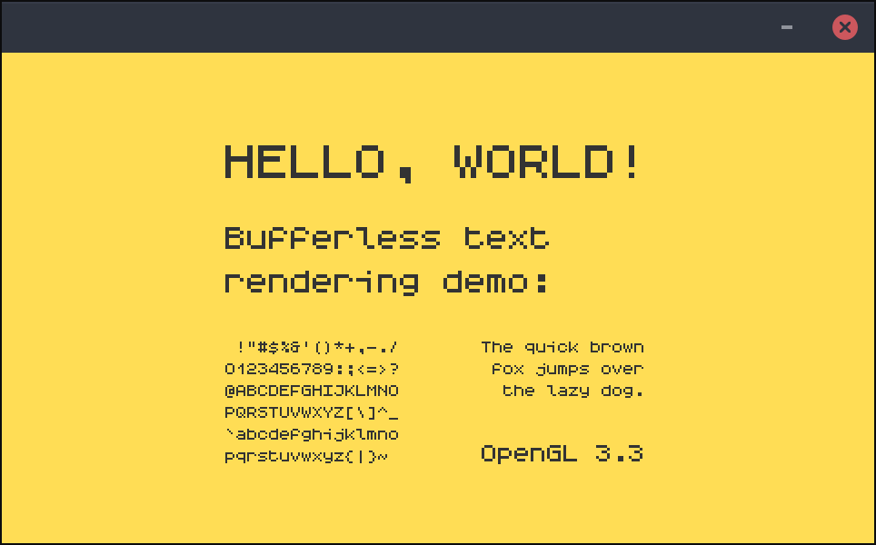

textshader
==========

Bufferless text rendering demo for OpenGL,
inspired by the [fullscreen quad] method.

Each glyph bitmap is encoded in a 32-bit integer.
A string of N chars can therefore be stored in
`uniform uint[N]`.

For each glyph, the vertex shader arranges a
quad on the fly, while the fragment shader decodes
the relevant bitmap from the uniform array. All
without the need for attribute buffers or textures.




Quads
-----

The vertex shader arranges every
six consecutive vertices to a quad.
To render a sequence of N quads, call
`glDrawArrays(GL_TRIANGLES, 0, N*6)`.

```
      (1,1)
  4--3 2
  | / /|
  |/ / |
  5 0--1
(0,0)

0 1 2 3 4 5   vertex = gl_VertexID % 6
0 1 1 1 0 0   u = (0b001110 >> vertex) & 1
0 0 1 1 1 0   v = (0b011100 >> vertex) & 1
```


Bitmaps
-------

Each 32-bit integer represents 6 lines of 5 bits.
The two remaining bits represent alternative quad
configurations, to effectively draw a 5x7 bitmap.

```
00...  01...  10...  11...  Upper 2 bits

LINE5         LINE0  LINE3
LINE4  LINE5  LINE5  LINE2
LINE3  LINE4  LINE4  LINE1
LINE2  LINE3  LINE3  LINE0  Lower 30 bits
LINE1  LINE2  LINE2  LINE0
LINE0  LINE1  LINE1  LINE5
       LINE0  LINE0  LINE4

AB...  gp...  ({...  j      Target glyphs
```


Build
-----

The demo depends on [SDL2] and OpenGL 3.3 Core.
Initialize the build directory and compile the demo with:

    cmake -B build
    cmake --build build

Generate the integer literals with:

    python3 font.py


[fullscreen quad]: https://www.reddit.com/r/gamedev/comments/2j17wk/a_slightly_faster_bufferless_vertex_shader_trick/
[SDL2]: https://github.com/libsdl-org/SDL
